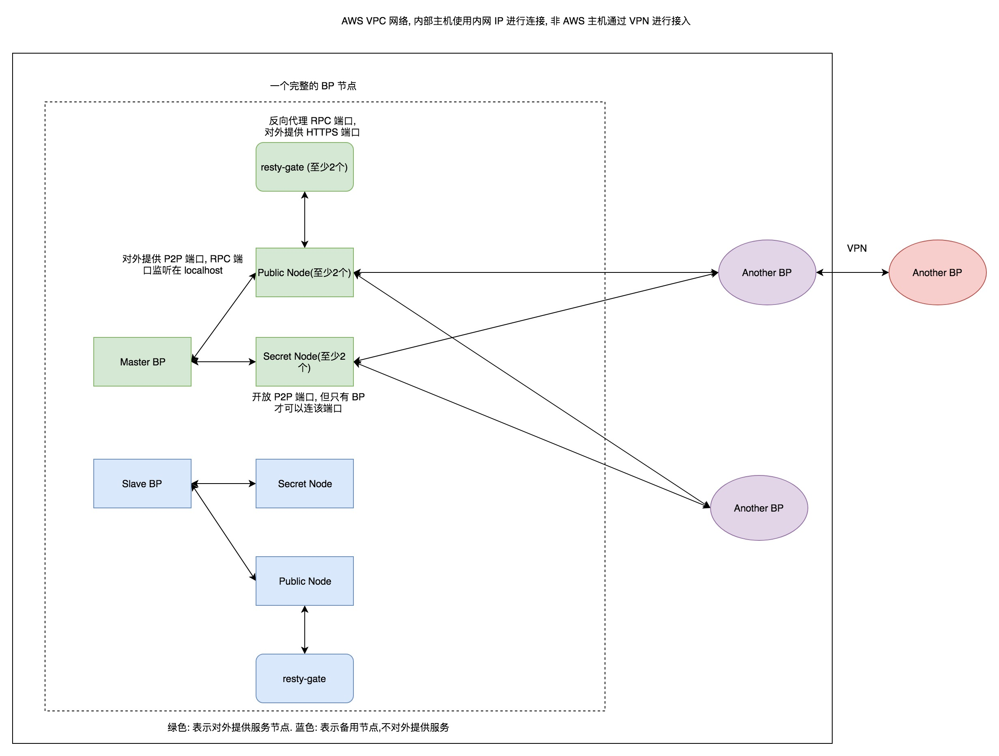

# BP 安全部署方案

<!-- vim-markdown-toc GFM -->

* [部署原则](#部署原则)
* [推荐架构](#推荐架构)
    * [架构图](#架构图)
    * [架构说明](#架构说明)
    * [出块节点](#出块节点)
        * [出块私钥](#出块私钥)
        * [屏蔽 RPC](#屏蔽-rpc)
        * [限制 P2P](#限制-p2p)
        * [其他](#其他)
    * [同步节点](#同步节点)
        * [config.ini](#configini)
        * [选配插件](#选配插件)
* [参考](#参考)

<!-- vim-markdown-toc -->

## 部署原则

- 隔离 BP 服务器
- 最小化开启功能插件
- 配置主从随时切换
- 避免单点故障

## 推荐架构

### 架构图



* 图示中的 AWS 可以替换成其他 VPS 供应商, 如: 阿里云, 腾讯云等.

* 冗余部署, 同时部署 Master 和 Slave 两套相同的方案, 分别部署到两个不同的机房。

* Slave BP 在 Master BP 正常出块的情况下, 配置为一个同步节点进行出块。

* 当 Master BP 出现问题(或者重启过程中)时, 切换为相应的出块节点.

### 架构说明

Slave 部署节点与 Master 部署节点, 每个对应的节点配置一致, 所以下面只讨论 Master 节点部署配置.

推荐使用 Docker 镜像 [eosforce/eos:v1.0](https://hub.docker.com/r/eosforce/eos/) 进行部署.

* Master BP 的 `p2p-peer-address` 地址只配置两个 p2p 地址，即与它相连的 Public Node 和 Secret Node.

* Public Node 用于与其他 BP 的 p2p 地址相连, 并且其 P2P 地址对外公开, 外部用户可以搭建同步节点与该地址连接进行同步区块.

* Secret Node 只用于与其他 BP 的 P2P 地址相连, IP 及端口号不对外公布, 不提供给外部用户的同步节点进行连接同步区块.

* Public Node 和 Secret Node 均至少各两台, 避免出现单点故障问题.

* Public Node 的 RPC 端口不直接对外提供服务, 而是使用 [resty-gate](https://github.com/eosforce/resty-gate) 做代理, [resty-gate](https://github.com/eosforce/resty-gate) 为一个基于 OpenResty 开发的项目, 用于对 RPC 端口做 HTTPS 代理, 限流, 限速, 防御等.

### 出块节点

出块节点只配置 `chain_api_plugin`:

```ini
plugin = eosio::chain_api_plugin
```

#### 出块私钥

在执行 `updatebp` 注册 BP 时，参数 `block_signing_key` 不要填写账户私钥，即不要填 active 或 owner key，而要单独创建一对新的秘钥用于出块。

#### 屏蔽 RPC

将 `http-server-address =` 置为空禁用 RPC。

```ini
http-server-address = # 空表示禁用
```

#### 限制 P2P

```ini
p2p-listen-endpoint = <inbound ip>:9876 # 只允许自己的同步节点连接, 实际部署时换成其他随机端口.
p2p-peer-address = xx.xx.xx.xx:9876 # 自己的 BP 的同步节点, 实际部署时换成其他随机端口.
```

#### 其他

```ini
enable-stale-production = false
max-clients = <同步节点数*2> # 即 (Public Node + Secret Node)*2
producer-name = <出块账户名称>
signature-provider = <pubkey>=KEY:<privkey>
```

### 同步节点

#### config.ini

```ini
http-server-address = 127.0.0.1:8888 #  RPC 端口监听在本地, 使用代理对外提供服务.
access-control-allow-origin = *
access-control-allow-headers = Content-Type
access-control-allow-credentials = false

# 实际部署时换成其他随机端口.
p2p-listen-endpoint = 0.0.0.0:9876

# 实际部署时换成其他随机端口.
p2p-server-address = <public ip>:9876

# 自己的 BP 以及其他 BP 的同步节点
p2p-peer-address = xx.xx.xx.xx:9876

# 可根据自己机器配置情况来调大, 但不建议过大.
max-clients = 25
```

#### 选配插件

同步节点可以按需配置一些插件:

```ini
# 当启用的插件比较多并开启 get-actions-on = true 时需要适当增大 chain-state-db-size-mb，
# 否则可能因为 state 目录容量不大导致同步节点无法同步。
chain-state-db-size-mb = 10240

# chain_api_plugin 用于 RPC 服务
plugin = eosio::chain_api_plugin

# 设置 filter-on = *, get-actions-on = true 可以获取全部的交易记录
# 这两个配置项一般用于浏览器，钱包等
filter-on = *
get-actions-on = true

# filter-on 和 get-actions-on 两个配置项需要启用 history_plugin
plugin = eosio::history_plugin
plugin = eosio::history_api_plugin
```

## 参考

- https://github.com/slowmist/eos-bp-nodes-security-checklist
